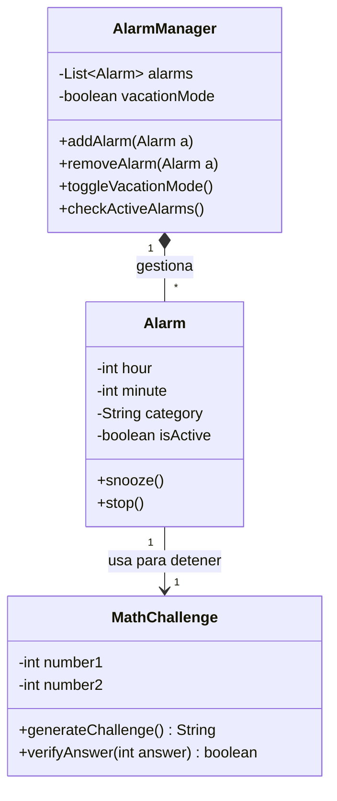

## Diagrama de Clases UML

### Justificación del Diseño Orientado a Objetos

He decidido estructurar la lógica en tres clases principales para cumplir con el principio de Responsabilidad Única (Single Responsibility Principle de SOLID):

1. **AlarmManager:** Es la clase controladora. Su responsabilidad es guardar la lista de alarmas y encender/apagar el "Modo Vacaciones". Al encapsular la lista de alarmas aquí (con visibilidad privada `-`), evitamos que otras partes del programa modifiquen la lista por accidente.

2. **Alarm:** Representa los datos individuales de una alarma (hora, minutos, categoría). Tiene los métodos básicos de `snooze()` y `stop()`. Sus atributos son privados para proteger la coherencia de la hora.

3. **MathChallenge:** He desacoplado la lógica del reto matemático en su propia clase. Si en el futuro queremos cambiar las matemáticas por un puzzle de palabras, la clase `Alarm` no sufrirá modificaciones.

**Relaciones:**

* Existe una relación de **Composición** entre `AlarmManager` y `Alarm` porque el gestor contiene múltiples alarmas.
* Existe una relación de **Asociación** entre `Alarm` y `MathChallenge` porque la alarma necesita interactuar con el reto para detenerse.
